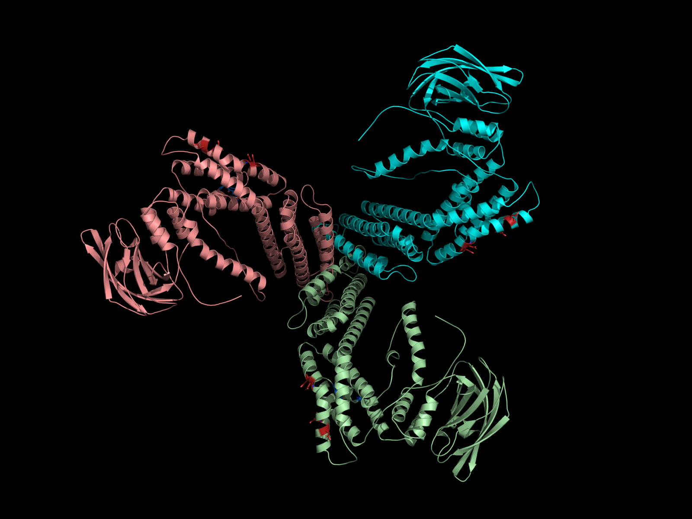
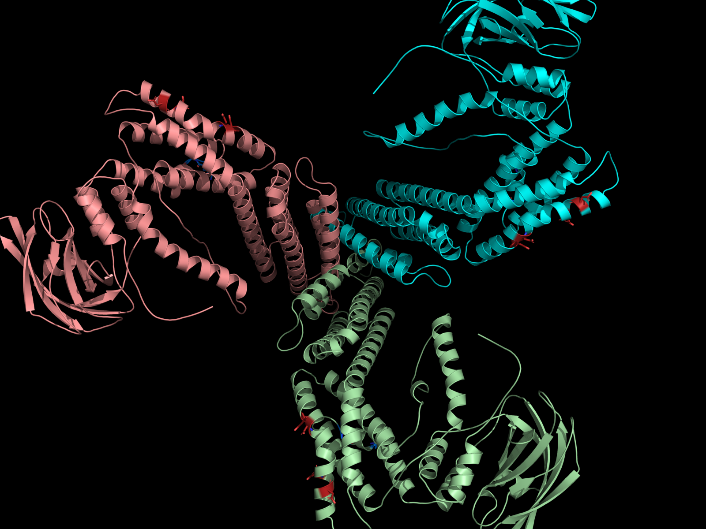
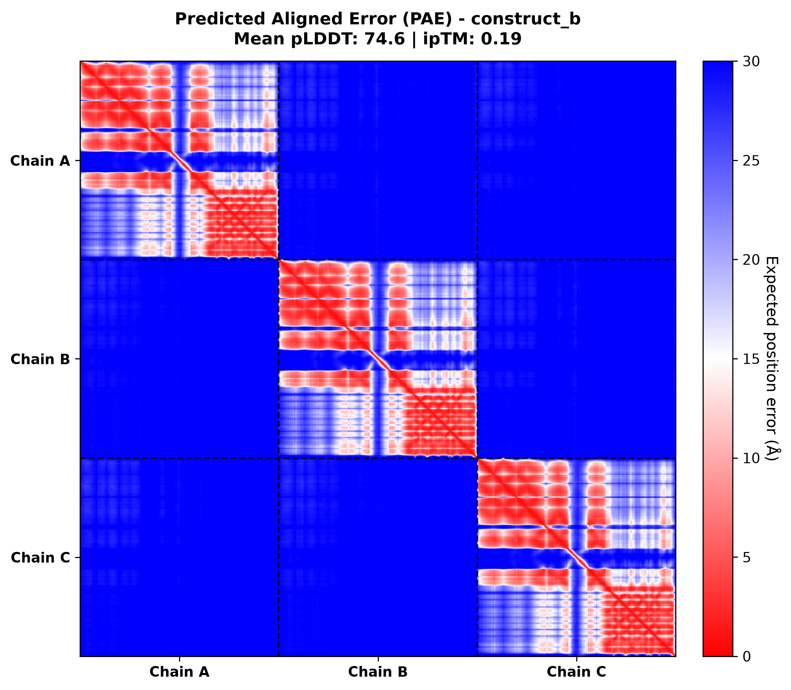

# Serverless Munc13-1 AlphaFold2-Multimer Prediction Pipeline on Modal

A high-performance, serverless structural prediction pipeline built on [Modal](https://modal.com) using `colabfold_batch` (AlphaFold2-multimer v3) to model Munc13-1 macromolecular complexes and active zone condensates.

---

## 1. Biological Context & Target Constructs

Full-length Munc13-1 is a massive homooligomer (~5,200 residues as a trimer) containing an extensive, highly flexible intrinsically disordered linker (residues 151–528) that causes severe aggregation and exceeds GPU VRAM boundaries. To achieve tractable, atomistic structural predictions, the computational targets are divided into three biologically grounded constructs:

| Construct | Name | Subunits / Stoichiometry | Residues per Monomer | Total Residues | Key Interface / Biological Purpose |
| :--- | :--- | :--- | :--- | :--- | :--- |
| **Construct A** | **Munc13C Trimer** | $A_3$ Homotrimer | 1,145 AA | 3,435 AA | Functional core (residues 529–1735, $\Delta$ 1408–1452 replaced with EF) evaluating the upright trimer MUN interface. |
| **Construct B** | **MUN-C2C Minimal Trimer** | $B_3$ Homotrimer | 569 AA | 1,707 AA | Reduced-memory test evaluating the electrostatic trimer contact patch (K1495/K1500 and D1358/D1369). |
| **Construct C** | **Active Zone Condensate Heterodimer** | $C_1 : C_2$ Heterodimer | 150 AA + 120 AA | 270 AA | Munc13-1 C2A (1–150) paired with RIM1α zinc-finger domain (1–120) capturing synaptic scaffolding switch. |

---

## 2. Architecture & Memory Management

### Memory Optimization for Massive Multimers
- **80 GB NVIDIA A100 GPU** (`modal.gpu.A100(size="80GB")` / `"A100-80GB"`).
- **Physical High-Bandwidth VRAM Allocation**: `TF_FORCE_UNIFIED_MEMORY="0"` and `XLA_PYTHON_CLIENT_MEM_FRACTION="0.90"` preallocate ~73.5 GB of native physical VRAM upfront. This completely eliminates unified memory paging, CPU page fault thrashing, and gVisor `cuMemAllocManaged` sandbox syscall deadlocks.
- **Fast Execution**: Construct B (1,707 residues, 3 chains) folds in **under 5 minutes** on the 80 GB A100 with 3 recycles.

### Cold-Start Prevention with Persistent Modal Volumes
- AlphaFold2 model weights (~5 GB) are stored in a dedicated `modal.Volume("colabfold-params")` mounted to `/root/params`.
- Pre-downloading and committing weights ensures weights are cached permanently across executions, eliminating multi-gigabyte download latency during inference.
- An additional `modal.Volume("colabfold-outputs")` persistently backs up all generated predictions in the cloud.

---

## 3. Directory Layout

```text
running-af2/
├── pyproject.toml          # Project configuration, dependencies, and metadata managed by uv
├── uv.lock                 # Deterministic dependency lockfile
├── app.py                  # Modal App, container image (ColabFold, Jax CUDA 12), and persistent volume
├── runner.py               # Remote inference function running colabfold_batch on 80 GB A100
├── run_prediction.py       # Local CLI entrypoint with streaming logs and automatic synchronization
├── analyze_results.py      # PAE heatmap plotting, chain demarcation, and trimer contact quality checks
├── targets/                # Input FASTA files (chains delimited by ':')
│   ├── construct_a.fasta   # Construct A (Munc13C Trimer, 3x 1,145 AA)
│   ├── construct_b.fasta   # Construct B (MUN-C2C Minimal Trimer, 3x 569 AA)
│   └── construct_c.fasta   # Construct C (C2A - RIM1α heterodimer, 150 AA : 120 AA)
├── outputs/                # Local synchronized results (.pdb, .json, .a3m, .png)
└── .venv/                  # Local Python virtual environment managed by uv
```

---

## 4. Quickstart & Usage

### 4.1 Install `uv` & Sync Environment
This repository is managed with [`uv`](https://docs.astral.sh/uv/), an extremely fast Python package manager and project resolver.

```bash
# Install uv (if not already installed)
curl -LsSf https://astral.sh/uv/install.sh | sh

# Automatically create virtual environment (.venv) and sync locked dependencies
uv sync
```

Alternatively, you can activate the virtual environment manually:
```bash
source .venv/bin/activate
```

### 4.2 Validate Targets (Dry Run)
Verify multimer FASTA syntax (`>header\nCHAIN1:CHAIN2:...`) and residue integrity locally without initiating cloud compute:
```bash
uv run python run_prediction.py --all --dry-run
```

### 4.3 Pre-Cache Model Weights
Explicitly trigger parameter download and volume commit to prevent inference latency:
```bash
uv run python run_prediction.py --download-weights
```

### 4.4 Run Predictions
Predict single constructs or all constructs using `uv run`:
```bash
# Run Construct B (Minimal Trimer - reduced memory benchmark)
uv run python run_prediction.py --target construct_b

# Run Construct C (C2A - RIM1α active zone heterodimer)
uv run python run_prediction.py --target construct_c

# Run Construct A (Full Munc13C Trimer, 3,435 residues)
uv run python run_prediction.py --target construct_a

# Run all targets sequentially
uv run python run_prediction.py --all
```

---

## 5. Output Verification & Quality Checks

Upon job completion, files are synchronized to `outputs/<target_name>/`:
- `<target>_relaxed_rank_001_...pdb`: Amber-relaxed top-ranked structure coordinates.
- `<target>_scores_rank_001_...json`: Per-residue pLDDT, predicted aligned error (PAE) matrix, pTM, and ipTM.
- `<target>_pae_annotated.png`: Annotated PAE heatmap with dashed chain boundaries and chain labels.

### Specific Interface Metrics
The built-in analysis tool automatically verifies critical contact interfaces:
- **Construct B Trimer Electrostatic Patch**: Computes minimum and mean PAE between the basic patch (K1495/K1500) of Chain $i$ and the acidic patch (D1358/D1369) of Chain $i+1$.
- **Construct A Trimer MUN Core**: Computes inter-chain PAE across the upright trimer contact face.
- **Construct C Active Zone Heterodimer**: Evaluates the binding interface between Munc13-1 C2A (1–150) and RIM1α zinc finger (1–120).

To re-run quality checks on existing predictions at any time:
```bash
uv run python analyze_results.py outputs/construct_b targets/construct_b.fasta
```

### PyMOL 3D Visual Rendering
To generate high-resolution PyMOL renderings and interactive session files (`.pse`) with automatic script dependency resolution:
```bash
uv run visualize_construct_b.py
```

### Example Structural Validation (Construct B Minimal Trimer)

| Trimer Assembly & Chains | Electrostatic Contact Zoom | Annotated PAE Heatmap |
| :---: | :---: | :---: |
|  |  |  |
| *Construct B* $B_3$ *homotrimer colored by chain* | *Basic patch (K1495/K1500) and acidic patch (D1358/D1369)* | *Inter-chain PAE demarcated with chain boundaries* |

